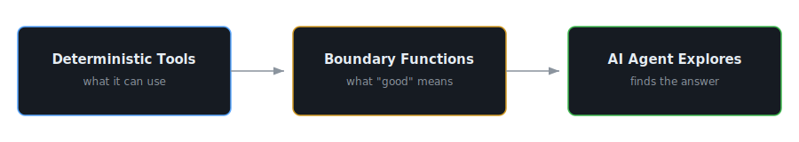

<h1 align="center">
  
</h1>

  
  
  
  
  

---

### The design philosophy

Every project I build follows the same architecture:

  

<table>
<tr>
<td width="20%"><strong>Project</strong></td>
<td width="25%"><strong>Tools</strong></td>
<td width="25%"><strong>Boundaries</strong></td>
<td width="30%"><strong>Agent does</strong></td>
</tr>
<tr>
<td><a href="https://github.com/hzy-hits/QuantStack"><b>QuantStack</b></a></td>
<td>Data pipelines, 15 analytics modules</td>
<td>Bayesian probability framework, "narrate facts only"</td>
<td>Synthesizes daily research reports across 750 US + 300 CN equities</td>
</tr>
<tr>
<td><a href="https://github.com/hzy-hits/QuantfactorLab"><b>QuantfactorLab</b></a></td>
<td>Factor DSL (~35 ops), backtest engine</td>
<td>5-gate anti-overfit filter, hidden holdout, JEPA dedup</td>
<td>Discovers alpha factors autonomously — only gets pass/fail</td>
</tr>
<tr>
<td><a href="https://github.com/hzy-hits/codex-par"><b>codex-par</b></a></td>
<td>Process isolation, wave scheduler</td>
<td>Dependency DAG, budget cap</td>
<td>Runs coding tasks in parallel (90 min → 30)</td>
</tr>
<tr>
<td><a href="https://github.com/hzy-hits/IvenaMeet"><b>IvenaMeet</b></a></td>
<td>Agent API with simulate/execute</td>
<td>Permissions, rate limits</td>
<td>Controls a live streaming room safely</td>
</tr>
</table>

---

### What's running in production

<table>
<tr>
<td width="50%" valign="top">

**[QuantStack](https://github.com/hzy-hits/QuantStack)** `Python` `Rust`

~750 US equities 2x daily, 300+ A-shares daily. Rust fetcher → 8 APIs → DuckDB → 15 Bayesian modules → 4 parallel LLM analysts → email before market open.

</td>
<td width="50%" valign="top">

**[QuantfactorLab](https://github.com/hzy-hits/QuantfactorLab)** `Python`

LLM agents propose factors in a constrained DSL. Walk-forward backtest + 5-gate anti-overfit filter validates. Agent never sees holdout — only pass/fail. Auto-retirement on decay.

</td>
</tr>
<tr>
<td width="50%" valign="top">

**[IvenaMeet](https://github.com/hzy-hits/IvenaMeet)** `Rust` `React` `LiveKit`

Private streaming platform. 30 endpoints, full auth lifecycle, broadcast orchestration, agent API. 81 commits, daily use.

</td>
<td width="50%" valign="top">

**[codex-par](https://github.com/hzy-hits/codex-par)** `Rust`

MCP deadlocks multi-agent workflows. Bypassed it — process isolation + dependency waves. 14-tool MCP server for dynamic dispatch.

</td>
</tr>
</table>

